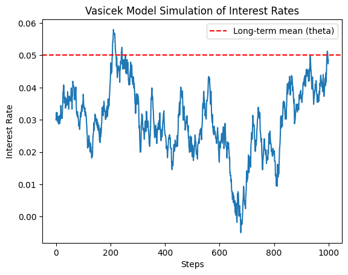
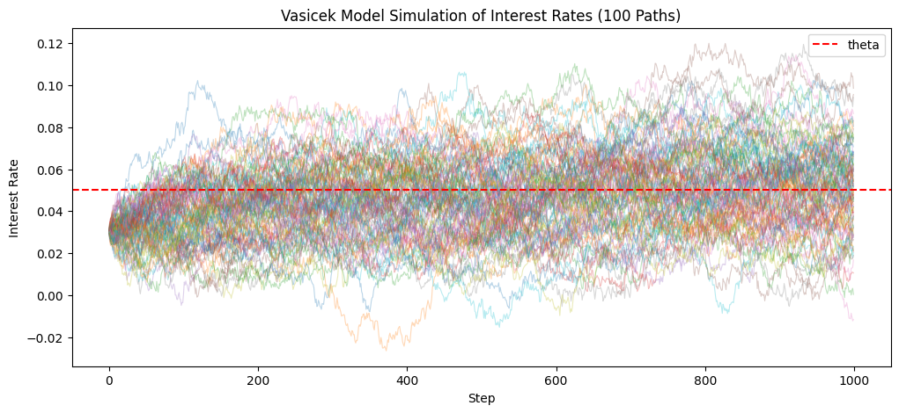
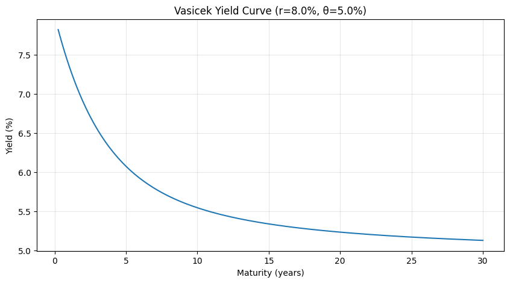
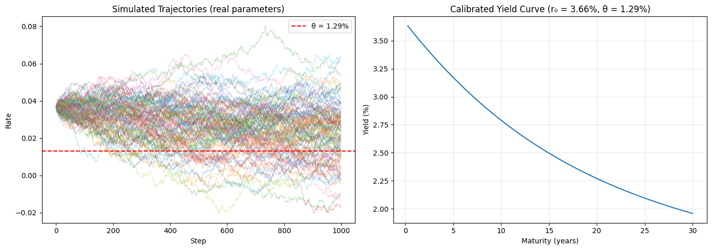

# Interest Rate Modelling with the Vasicek Short-Rate Model

Simulation and calibration of the Vasicek (1977) short-rate model in Python.

## What this project does

This project implements the Vasicek short-rate model to simulate stochastic interest rate dynamics and analyse the pricing of zero-coupon bonds. The model is calibrated using historical U.S. Treasury yields and aplied to study the relationship between interest rate evolution, yield curves and bond prices

## Motivation

Interest rate models play a central role in fixed income investing, allowing practitioners to model the evolution of short-term rates and evaluate the impact of interest rate movements on bond prices.

This project implements one of the most widely studied short-rate models and applies it to real Treasury data.

## Investment Interpretation

Interest rate models are widely used in fixed income portfolio management to value bonds, assess duration risk and perform scenario analysis.

This implementation demonstrates how stochastic short-rate models can support portfolio construction and interest rate risk management.

## Model

The Vasicek model describes the evolution of the short rate as:

$$dr_t = \kappa(\theta - r_t)dt + \sigma dW_t$$

Where:
- κ: speed of mean reversion
- θ: long-run mean rate
- σ: volatility
- W_t: standard Brownian motion

Zero-coupon bond prices have a closed-form solution: P(t,T) = A(t,T) · exp(−B(t,T) · r_t)

## Features

- Historical Treasury yield acquisition
- Vasicek parameter calibration
- Short-rate simulation
- Zero-coupon bond pricing
- Yield curve construction
- Sensitivity analysis
- Visualization

## Data

Parameters are estimated via OLS regression on monthly 3-Month Treasury Bill rates
sourced from FRED (Federal Reserve Bank of St. Louis), from 2000 to present.

## Key Findings

- The calibrated Vasicek model successfully reproduces the mean-reverting behaviour observed in historical short-term interest rates.
- Simulated interest rate paths illustrate the stochastic evolution of rates around the estimated long-run equilibrium.
- Zero-coupon bond prices decrease as simulated interest rates increase, consistently with fixed income theory.
- Longer maturities exhibit greater sensitivity to changes in interest rates.

## Results

## Results

### Single Interest Rate Simulation

Illustration of one simulated short-rate path under the calibrated Vasicek model.

_A single simulated short-rate path illustrates the mean-reverting behaviour of interest rates under the calibrated Vasicek model._

---

### Multiple Simulated Paths

Monte Carlo simulation of multiple short-rate trajectories highlighting the stochastic behaviour and mean reversion of interest rates.

_Monte Carlo simulations highlight the stochastic evolution of short-term interest rates while preserving long-run mean reversion around the estimated equilibrium level._

---

### Yield Curve

Zero-coupon yield curve implied by the calibrated Vasicek model.

_The model-implied zero-coupon yield curve illustrates how yields vary across maturities under the calibrated interest rate process._

---

### Model Validation

Comparison between the simulated terminal distribution of short rates and the analytical stationary distribution implied by the model.

_The simulated terminal distribution closely matches the analytical distribution implied by the Vasicek model, supporting the correctness of the implementation._

---

### Model Calibration

Comparison between historical Treasury yields and the calibrated Vasicek trajectory.

_Historical U.S. Treasury yields are used to calibrate the Vasicek model. The estimated parameters provide the basis for interest rate simulations and zero-coupon bond pricing._

## Limitations

Being a Gaussian process, Vasicek does not preclude negative interest rates.
The Cox-Ingersoll-Ross (CIR) model addresses this by ensuring non-negativity.

## Libraries

numpy, matplotlib, pandas-datareader, ipywidgets

## Author

Carlo — MSc Finance student, Bocconi University
